# TaskFlow

A collaborative task management platform: projects, Kanban boards, tasks with
subtasks and comments, teams, and notifications.

The application is built as six independently deployable NestJS services and an
Angular client. The functionality is deliberately familiar; the point of the
project is the architecture underneath it, where each service owns its own
database and services communicate through a mix of synchronous HTTP and
asynchronous Kafka events.

## Live deployment

| Component | URL |
| --- | --- |
| Frontend | https://summer-internship-2026-continuous.vercel.app |
| API Gateway | https://api-gateway-xafr.onrender.com |
| API documentation | `https://<service-host>/docs` (Swagger UI, per service) |

The backend runs on Render's free tier, where a service sleeps after roughly
15 minutes without traffic and takes 25 to 45 seconds to wake. The first
request after an idle period is therefore slow. See
[Free tier behaviour](#free-tier-behaviour).

## Contents

- [Features](#features)
- [Architecture](#architecture)
- [Technology stack](#technology-stack)
- [Repository layout](#repository-layout)
- [Running locally](#running-locally)
- [Environment variables](#environment-variables)
- [API overview](#api-overview)
- [Testing](#testing)
- [Continuous integration and deployment](#continuous-integration-and-deployment)
- [Production deployment](#production-deployment)
- [Known limitations](#known-limitations)

## Features

- Account registration and login, with refresh-token sessions that survive a
  page reload.
- Projects with members, per-project roles (owner, admin, member), categories
  and configurable board columns.
- Tasks with status, priority, assignee, deadline, subtasks, comments and a
  full change history.
- A Kanban board with drag and drop between columns.
- Teams, with membership managed by platform administrators.
- Notifications, created automatically when a task is assigned, when its status
  changes, when a deadline is approaching, and when an account is created.
- Platform administration: list all accounts and change their platform role.

## Architecture

The browser never talks to a business service directly. Every request enters
through the API Gateway, which verifies the caller's token once and proxies the
request onward.

```mermaid
flowchart TD
  B["Browser - Angular 19"]
  G["API Gateway :3000<br/>JWT verification + proxy"]

  A["Auth Service :3001"]
  U["User Service :3002"]
  P["Project Service :3003"]
  T["Task Service :3004"]
  N["Notification Service :3005"]

  K(["Kafka"])
  R[("Redis")]

  DBa[("auth_db")]
  DBu[("user_db")]
  DBp[("project_db")]
  DBt[("task_db")]
  DBn[("notification_db")]

  B -->|HTTPS| G
  G --> A
  G --> U
  G --> P
  G --> T
  G --> N

  T -.->|"membership check (sync HTTP)"| P

  A ==>|"publishes user.registered"| K
  T ==>|"publishes task-events"| K
  K ==>|consumes| U
  K ==>|consumes| N

  P <--> R
  T <--> R

  A --- DBa
  U --- DBu
  P --- DBp
  T --- DBt
  N --- DBn
```



Solid arrows are synchronous HTTP, double arrows are asynchronous Kafka events,
and the dotted arrow is the only synchronous service-to-service call in the
system.

### Services

| Service | Port | Owns | Talks to |
| --- | --- | --- | --- |
| `api-gateway` | 3000 | Nothing; it is stateless | All five services |
| `auth-service` | 3001 | `users`, `refresh_tokens` | Kafka (producer) |
| `user-service` | 3002 | `profiles`, `teams` | Kafka (consumer) |
| `project-service` | 3003 | `projects`, `project_members`, `board_columns`, `categories` | Redis |
| `task-service` | 3004 | `tasks`, `subtasks`, `comments`, `task_history` | Kafka (producer), Redis, HTTP to project-service |
| `notification-service` | 3005 | `notifications` | Kafka (consumer) |

### Communication

Services communicate in two distinct ways, and the distinction is the core
design decision of the system.

**Synchronously, over HTTP**, when the caller needs an answer before it can
proceed. Task Service must know whether the caller is a member of a project
before returning its tasks, so it asks Project Service and waits.

**Asynchronously, over Kafka**, when the caller only needs to announce that
something happened and does not care who reacts, or when. Registration
publishes an event and returns immediately.

| Topic | Published by | Consumed by | Events |
| --- | --- | --- | --- |
| `user.registered` | auth-service | user-service, notification-service | Account created |
| `task-events` | task-service | notification-service | `TaskCreated`, `TaskAssigned`, `TaskStatusChanged`, `TaskDeadlineReminder` |

Both consumers of `user.registered` read the topic independently, in their own
consumer groups: User Service creates the profile, Notification Service creates
a welcome notification, and auth-service knows about neither. Publishing is
fire and forget, so a broker problem degrades notifications rather than
breaking registration.

`TaskDeadlineReminder` is not triggered by a user. A scheduled job inside Task
Service runs every hour, finds unfinished tasks due within 24 hours, and
publishes a reminder for each. A `reminderSent` flag on the task makes the
sweep idempotent, so the same task cannot produce a reminder every hour.

### Database per service

Each service owns its database and no service may read another's tables. Every
cross-service reference (`projectId`, `assigneeId`, `userId`) is a plain UUID
column with **no foreign key**, because the row it points at lives in a
different database.

The consequences are deliberate: there are no joins across services, the
database cannot enforce those references, and authorisation that depends on
another service's data requires a network call. This is why Task Service asks
Project Service about membership instead of querying a members table.

### Caching

Project Service and Task Service cache read-heavy queries in Redis using the
cache-aside pattern: check the cache, fall back to PostgreSQL on a miss,
populate the cache on the way back, and delete the affected keys on every
write.

| Service | Key prefix | TTL |
| --- | --- | --- |
| project-service | `project-service:projects:` | 30 seconds |
| task-service | `task-service:tasks:` | 15 seconds |

Redis holds only derived data that can be recomputed, never a source of truth.
Every cache operation swallows its errors and reports a miss, so if Redis is
slow or unreachable the application still serves correct data from PostgreSQL,
only more slowly.

### Authentication and authorisation

Authentication uses a short-lived access token plus a long-lived refresh token.

| | Access token | Refresh token |
| --- | --- | --- |
| Format | JWT, signed and self-describing | Opaque, 48 random bytes |
| Lifetime | 15 minutes | 7 days |
| Stored | In memory, sent as a header | httpOnly cookie, and hashed in the database |
| Revocable | No, it must expire | Yes, immediately |

Passwords are hashed with bcrypt. Refresh tokens are stored as SHA-256 hashes,
so a database leak cannot be replayed, and they rotate on every use. Each
service verifies the JWT locally with the shared secret; no service calls
auth-service to validate a token.

Authorisation has two independent levels:

- **Platform role** (`admin` or `member`), carried in the JWT. Controls user
  management and team management.
- **Project role** (`owner`, `admin` or `member`), stored per project. Controls
  access to a specific board.

Being a platform administrator does not grant access to someone else's private
project.

## Technology stack

| Layer | Technology |
| --- | --- |
| Backend | NestJS 10, TypeScript |
| Frontend | Angular 19, Angular Material |
| Database | PostgreSQL with TypeORM |
| Messaging | Apache Kafka (KRaft mode locally, Redpanda Cloud in production) |
| Cache | Redis |
| API documentation | Swagger / OpenAPI, generated from decorators |
| Containers | Docker and Docker Compose |
| CI/CD | GitHub Actions |
| Hosting | Render (backend), Vercel (frontend) |

## Repository layout

```
taskflow/
  docker-compose.yml        Local stack: 6 services, 5 databases, Kafka, Redis
  render.yaml               Render blueprint for the deployed backend
  .env                      Local secrets for docker-compose (not committed)
  POSTMAN_TESTING_GUIDE.md  Manual API testing walkthrough
  .github/workflows/
    ci.yml                  Build, test and deploy pipeline
    keep-warm.yml           Scheduled pings that keep free-tier services awake
  services/
    api-gateway/            Single public entry point
    auth-service/           Accounts, passwords, tokens
    user-service/           Profiles and teams
    project-service/        Projects, members, columns, categories
    task-service/           Tasks, subtasks, comments, history
    notification-service/   Notifications
  frontend/                 Angular client
```

Every service follows the same structure: `src/<feature>/` with a controller, a
service, DTOs and entities, plus `src/config/env.validation.ts`, which
validates environment variables at startup and refuses to boot on invalid
configuration.

## Running locally

### Prerequisites

- Docker Desktop, running
- Node.js 20 and npm (for the frontend)

### 1. Create the root environment file

Docker Compose reads three variables from a `.env` file at the repository root.
Create it:

```
JWT_ACCESS_SECRET=<a random string of at least 32 characters>
ADMIN_EMAIL=admin@taskflow.dev
ADMIN_PASSWORD=<at least 8 characters>
```

Generate a suitable secret:

```bash
node -e "console.log(require('crypto').randomBytes(64).toString('hex'))"
```

`JWT_ACCESS_SECRET` must be identical across all services, because each one
verifies tokens with it. Startup fails with a clear error if it is shorter than
32 characters.

`ADMIN_EMAIL` and `ADMIN_PASSWORD` are optional. When both are set,
auth-service creates that account as a platform administrator on startup, or
promotes it if it already exists. Registration alone can never produce an
administrator, so this is the only way to create the first one. Note that
promotion does not change an existing account's password.

### 2. Start the backend

```bash
docker compose up -d --build
```

This starts Kafka, Redis, five PostgreSQL databases and the six services.
The first build takes several minutes. Services wait for their database and
for Kafka to report healthy before starting.

Check that everything is running:

```bash
docker compose ps
docker compose logs -f api-gateway
```

Kafka topics are created automatically in the local setup.

### 3. Start the frontend

The frontend is not part of Docker Compose. In a second terminal:

```bash
cd frontend
npm install
npm start
```

The application is then at http://localhost:4200 and talks to the gateway at
http://localhost:3000.

### Local endpoints

| Service | URL |
| --- | --- |
| Frontend | http://localhost:4200 |
| API Gateway | http://localhost:3000 |
| Auth Service | http://localhost:3001, Swagger at `/docs` |
| User Service | http://localhost:3002, Swagger at `/docs` |
| Project Service | http://localhost:3003, Swagger at `/docs` |
| Task Service | http://localhost:3004, Swagger at `/docs` |
| Notification Service | http://localhost:3005, Swagger at `/docs` |
| PostgreSQL | ports 5433 to 5437, one per service |
| Kafka | localhost:9092 |
| Redis | localhost:6379 |

### Stopping

```bash
docker compose down           # stop the stack, keep the data
docker compose down -v        # stop and delete all database volumes
```

### Working on a single service

To run one service outside Docker, stop that container, copy the service's
`.env.example` to `.env`, adjust the host names from Docker service names to
`localhost`, and run:

```bash
cd services/<service-name>
npm install
npm run start:dev
```

## Environment variables

Each service ships a `.env.example` listing every variable it needs, and
validates them at startup. The main ones:

| Variable | Used by | Purpose |
| --- | --- | --- |
| `PORT` | all | HTTP port |
| `DB_HOST`, `DB_PORT`, `DB_USER`, `DB_PASSWORD`, `DB_NAME` | all except gateway | PostgreSQL connection |
| `JWT_ACCESS_SECRET` | all | Signs and verifies access tokens; must match everywhere |
| `JWT_ACCESS_TTL`, `REFRESH_TTL_DAYS` | auth | Token lifetimes |
| `KAFKA_BROKER` | auth, user, task, notification | Broker address |
| `KAFKA_SASL_USERNAME`, `KAFKA_SASL_PASSWORD` | auth, user, task, notification | Optional; enables SASL and TLS for a hosted broker |
| `REDIS_HOST`, `REDIS_PORT` | project, task | Cache connection |
| `PROJECT_SERVICE_URL` | task | Membership checks |
| `AUTH_SERVICE_URL`, `USER_SERVICE_URL`, `PROJECT_SERVICE_URL`, `TASK_SERVICE_URL`, `NOTIFICATION_SERVICE_URL` | gateway | Proxy targets |
| `CORS_ORIGIN` | gateway, auth | Allowed browser origin |
| `ADMIN_EMAIL`, `ADMIN_PASSWORD` | auth | Optional bootstrap administrator |

## API overview

Everything is reached through the gateway, which maps a URL prefix to a
service and verifies the token before forwarding.

| Prefix | Service | Token required |
| --- | --- | --- |
| `/auth` | auth-service | No; registration, login and refresh happen before a token exists |
| `/profiles`, `/teams` | user-service | Yes |
| `/projects`, `/categories` | project-service | Yes |
| `/tasks` | task-service | Yes |
| `/notifications` | notification-service | Yes |

Requests without a valid token are rejected at the gateway and never reach a
business service. Each business service exposes interactive Swagger
documentation at `/docs`, generated from the code, so endpoints and payloads
can be explored and called directly. `POSTMAN_TESTING_GUIDE.md` walks through
the main flows manually.

## Testing

```bash
cd frontend
npm test                      # unit tests, Karma and Jasmine

cd services/<service-name>
npm run build                 # type-check and compile
```

Test coverage is currently thin and is the most significant gap in the project:
the frontend has a single component test and the services have no automated
tests. Continuous integration compiles every changed service and builds its
Docker image, which catches compilation and packaging errors but not
behavioural regressions.

## Continuous integration and deployment

`.github/workflows/ci.yml` runs on every push and pull request to `main`.

1. A path filter detects which services a commit actually touched.
2. Only those services are installed, built and Docker-built, in a matrix.
3. The frontend job installs, builds and runs unit tests when `frontend/`
   changed.
4. Deployment jobs run only on `main`, and only if the matching build job
   succeeded, so a commit that does not compile cannot reach production.

Deployment triggers Render deploy hooks for changed services and deploys the
frontend with the Vercel CLI. Both require repository secrets
(`RENDER_DEPLOY_HOOK_*`, `VERCEL_TOKEN`, `VERCEL_ORG_ID`, `VERCEL_PROJECT_ID`).
Until those are configured, the platforms' own automatic deployment on push is
what updates the live environment.

`.github/workflows/keep-warm.yml` pings every service every ten minutes during
the day so that free-tier instances do not sleep. It is a workaround for
hosting limits rather than part of the application, and it consumes free
instance hours, so it should be disabled when not needed.

## Production deployment

The backend is described entirely by `render.yaml`, so the environment is
reproducible from source rather than assembled by hand in a dashboard. It
declares the six services, the databases, Redis, and a shared environment group
for the JWT secret. The frontend is a static Angular build on Vercel, with a
rewrite so that deep links are handled by the router.

Kafka is not declared there: Render has no Kafka product, so production uses
Redpanda Cloud, reached over SASL and TLS. Unlike the local broker, it does not
create topics automatically, so `user.registered` and `task-events` must exist
before the consumers start.

Two free-tier limits forced documented compromises, both explained in comments
in `render.yaml`:

- **One free database per workspace.** `auth_db` and `user_db` are additional
  logical databases on the same server as `project_db`. Each service still
  queries only its own database and no code changed, but the three share one
  server and one credential, which weakens isolation at the infrastructure
  level.
- **Free services cannot receive private network traffic.** They can send it,
  but not receive it, so internal calls over private hostnames always fail.
  Inter-service traffic therefore uses each service's public HTTPS URL,
  injected automatically through Render's `RENDER_EXTERNAL_URL` so that no
  hostname is hard-coded.

### Free tier behaviour

Services sleep after about 15 minutes of inactivity. Waking one takes 25 to 45
seconds, and several waking at once can briefly return `429` responses from the
hosting edge before the application is reached. The client compensates in two
ways: it pings every service when the application loads, so they wake while the
user is signing in, and it retries cold-start responses with backoff so that a
waking service appears as a slow request rather than an error. The scheduled
keep-warm workflow prevents the situation during the day.

## Known limitations

- **Automated tests are minimal.** One frontend component test, no service
  tests.
- **Notifications are polled**, every 20 seconds, rather than pushed. The
  backend has no WebSocket or SSE channel yet, although the client is
  structured so that only the feed service would change.
- **No distributed tracing.** A single user action can span four services with
  no correlation id tying the logs together.
- **Cache invalidation uses Redis `KEYS`**, which scans the whole keyspace and
  blocks the server. `SCAN`, or a tracked set of keys, would be required at
  real traffic levels.
- **No dead-letter queue.** If a consumer fails to handle an event, that
  notification is lost rather than retried.
- **Database isolation is weakened in production** by the shared PostgreSQL
  server described above.
- **A user belongs to at most one team**, since membership is a single column
  on the profile rather than a membership table.
